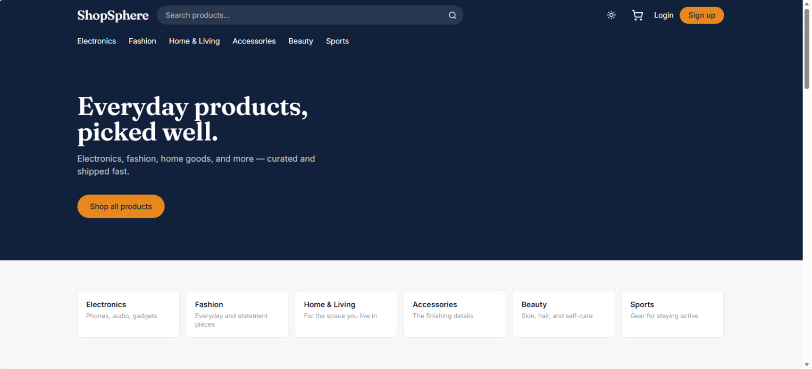
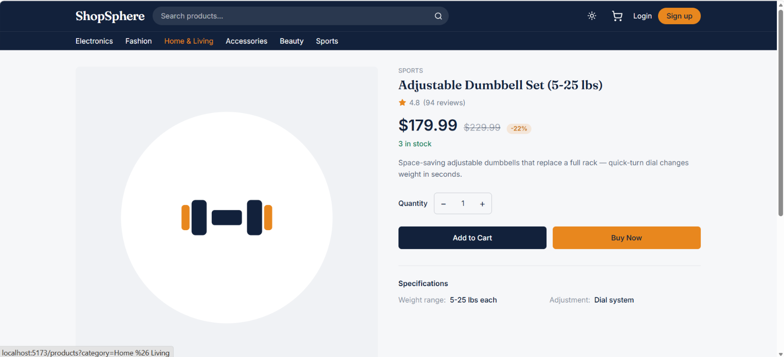
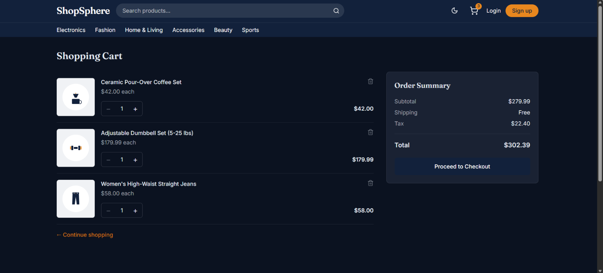
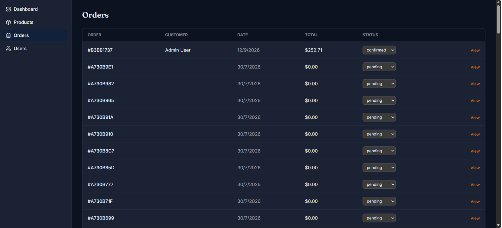
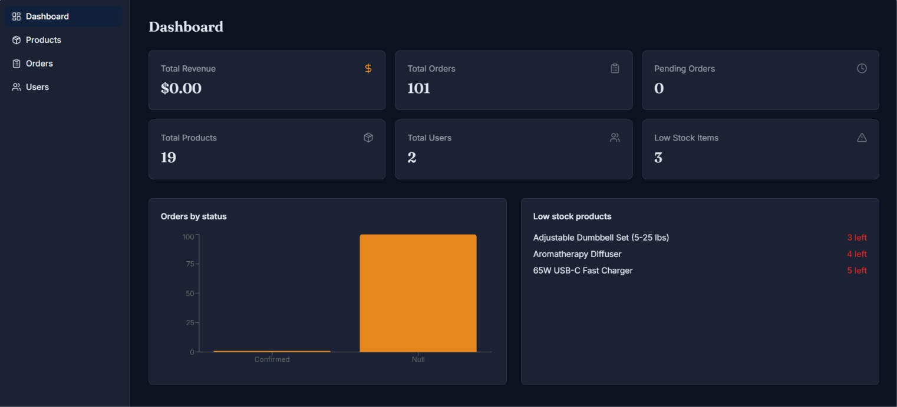

# ShopSphere

A full-stack e-commerce store built for the CodeAlpha Full Stack Development
Internship — product browsing, cart, checkout, order management, and an admin
dashboard, backed by a real REST API and MongoDB.

> Built with React + Vite on the frontend and Node/Express/MongoDB on the
> backend. Every feature listed below is wired to a real API — nothing here
> is a static mock.

## Features

**Customer**
- Browse, search, filter (category/price/rating), and sort products
- Product details with image gallery, stock-aware quantity selector
- Cart that works as a guest (localStorage) and merges into your account on login
- Checkout with server-calculated totals (never trusts client-sent prices)
- Order history and detailed order view
- Editable profile

**Admin**
- Dashboard: revenue, order counts, low-stock alerts, orders-by-status chart
- Full product CRUD (create/edit/delete, stock, pricing, featured flag)
- Order management with status updates
- User list

**Platform**
- JWT auth in an httpOnly cookie, bcrypt password hashing, role-based authorization
- Server-side validation on every write endpoint
- Rate limiting, Helmet, CORS
- Responsive: desktop / tablet / mobile, distinct layouts, not just scaled-down

## Screenshots

| Home | Product Details | Cart |
|------|------------------|------|
|  |  |  |

| Order History | Admin Dashboard |
|----------------|------------------|
|  |  |

> Drop your PNG/JPG files in a `screenshots/` folder at repo root, using the filenames above (or edit paths to match yours).

## Tech Stack

| Layer      | Tech                                                              |
|------------|---------------------------------------------------------------------|
| Frontend   | React, Vite, Tailwind CSS, React Router, Axios, React Hook Form, Context API |
| Backend    | Node.js, Express, Mongoose, JWT, bcryptjs, express-validator      |
| Database   | MongoDB                                                           |
| Testing    | Jest (unit tests, mocked models — no DB dependency)               |

## Architecture

```
shopsphere/
├── client/           React + Vite frontend
│   └── src/
│       ├── components/   Reusable UI (product, cart, checkout, order, admin, common)
│       ├── pages/         Route-level views
│       ├── layouts/       MainLayout / AuthLayout / AdminLayout
│       ├── context/        AuthContext, CartContext
│       ├── hooks/          useAuth, useCart, useDebounce
│       ├── services/       Axios API calls
│       └── routes/         ProtectedRoute, AdminRoute
├── server/            Express backend
│   ├── config/         env, db connection
│   ├── controllers/    Request handlers
│   ├── middleware/     auth, adminOnly, error handling, validation
│   ├── models/         User, Product, Cart, Order, Review
│   ├── routes/          REST endpoints
│   ├── services/       Server-side business logic (order totals)
│   ├── validators/      express-validator chains
│   ├── seed/            Demo data + seed script
│   └── tests/            Jest unit tests
├── TESTING.md         Manual QA checklist for DB-dependent flows
└── .env.example
```

### Data model

- **User** — name, email, hashed password, role (customer/admin), avatar
- **Product** — name, slug, price, originalPrice, category, images, stock, rating, specifications
- **Cart** — one per user, line items reference Product
- **Order** — snapshots item name/price/image at purchase time (so historical
  orders stay accurate even if a product is later changed or deleted);
  stores shipping address, payment method/status, order status, and a
  server-computed subtotal/shipping/tax/total
- **Review** — one per user per product, rating + comment

Order totals are **always calculated server-side** from the user's
server-side cart at checkout time — the client never sends a price the
server trusts.

## Getting Started

### Prerequisites
- Node.js 18+
- A MongoDB instance — local (`mongod`) or a free [MongoDB Atlas](https://www.mongodb.com/atlas) cluster

### 1. Clone and install

```bash
git clone <your-repo-url> shopsphere
cd shopsphere

cd server && npm install
cd ../client && npm install
```

### 2. Environment variables

Copy the example files and fill them in:

```bash
cp .env.example server/.env
cp client/.env.example client/.env
```

**`server/.env`**

| Variable         | Description                                  |
|------------------|-----------------------------------------------|
| `MONGO_URI`      | MongoDB connection string                     |
| `JWT_SECRET`     | Long random string — never commit a real one  |
| `JWT_EXPIRES_IN` | Token lifetime (default `7d`)                 |
| `PORT`           | API port (default `5000`)                     |
| `CLIENT_URL`     | Frontend origin, for CORS (default `http://localhost:5173`) |
| `NODE_ENV`       | `development` or `production`                 |

**`client/.env`**

| Variable       | Description               |
|----------------|----------------------------|
| `VITE_API_URL` | Backend API base URL      |

### 3. Seed demo data

```bash
cd server
npm run seed
```

This wipes and repopulates users + products with 19 realistic products
across all 6 categories, and prints demo credentials to the console.

### 4. Run it

```bash
# Terminal 1
cd server
npm run dev        # http://localhost:5000

# Terminal 2
cd client
npm run dev         # http://localhost:5173
```

### Demo credentials

| Role     | Email                     | Password       |
|----------|----------------------------|-----------------|
| Admin    | admin@shopsphere.test      | Admin123!       |
| Customer | customer@shopsphere.test   | Customer123!    |

## Testing

```bash
cd server
npm test
```

Runs 21 Jest unit tests covering auth logic, JWT middleware, role
authorization, cart stock validation, and order total math — all with
mocked models, so no database connection is required.

Flows that need a real database (registration round-trip, checkout →
inventory reduction, admin CRUD, authorization boundaries, responsive
layout) are covered in **[TESTING.md](./TESTING.md)** as a manual QA
checklist — run through it once locally before treating the app as
submission-ready.

## API Overview

All endpoints are prefixed with `/api`. Protected routes require the `token`
httpOnly cookie set on login/register. Admin routes additionally require
`role: admin`.

```
POST   /auth/register           Create account
POST   /auth/login              Log in
GET    /auth/me                 Current user            [auth]
PUT    /auth/profile            Update name/avatar      [auth]
POST   /auth/logout             Clear session

GET    /products                List (search/category/price/rating/sort/pagination)
GET    /products/:id            Single product
POST   /products                Create                  [admin]
PUT    /products/:id            Update                  [admin]
DELETE /products/:id            Delete                  [admin]

GET    /cart                    Current user's cart      [auth]
POST   /cart                    Add item                 [auth]
PUT    /cart/:productId         Update quantity          [auth]
DELETE /cart/:productId         Remove item               [auth]
DELETE /cart                    Clear cart                [auth]

POST   /orders                  Create order from cart   [auth]
GET    /orders/my-orders        Current user's orders    [auth]
GET    /orders/:id              Single order (owner/admin) [auth]
GET    /orders                  All orders                [admin]
PUT    /orders/:id/status       Update status              [admin]

GET    /admin/dashboard         Stats + orders-by-status  [admin]
GET    /admin/users             List users                [admin]

GET    /health                  API health check
```

## Deployment

- **Frontend**: any static host that supports a Vite build (Vercel, Netlify, Cloudflare Pages). Set `VITE_API_URL` to your deployed API.
- **Backend**: any Node host (Render, Railway, Fly.io, a VPS). Set all `server/.env` variables in the platform's env config — never commit `.env`.
- **Database**: [MongoDB Atlas](https://www.mongodb.com/atlas) free tier works fine for a portfolio deployment.
- Set `CLIENT_URL` on the backend to your deployed frontend origin so CORS and the cookie's `sameSite` policy work correctly.

## Future Improvements

- Product review system (model exists, UI not yet built)
- Stripe live-mode integration behind a feature flag
- Code-split the admin bundle (currently pulls recharts into the main chunk)
- Email notifications on order status change
- Server-side cart merge conflict resolution (currently last-write-wins on quantity)
- Order creation reduces stock per-item without a multi-document transaction (would need a MongoDB replica set); acceptable for this scale but worth wrapping in a session transaction for production

## Author

Built as part of the CodeAlpha Full Stack Development Internship.
